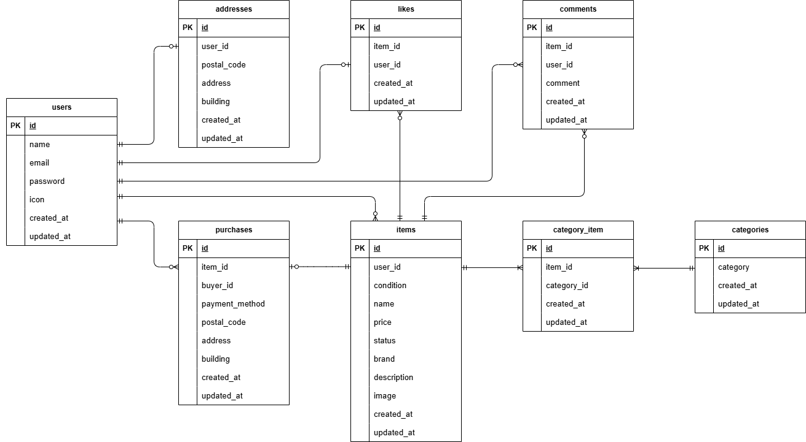

# mock-project_FleaMarket

## 概要
Laravelを用いて開発したフリマアプリです。 
出品、購入、コメント、いいね機能を実装しています。 
決済にはStripeを使用しています。 

模擬案件として、Dockerによる開発環境構築から、
データベース設計・決済処理・テスト実装まで一貫して開発しました。

## 環境構築
※ Docker Desktop を起動した状態で以下の手順を実行してください。 

1. リポジトリをクローン
- git clone git@github.com:TakakazuSekiguchi/mock-project_FleaMarket.git
- cd mock-project_FleaMarket
- docker-compose up -d --build

2. composer install
- docker-compose exec php composer install

3. `.env`を作成
- cd src
- cp .env.example .env

docker-compose.ymlのmysqlの箇所を参考に、設定値を変更してください。 

DB_HOST=mysql 
DB_DATABASE=laravel_db 
DB_USERNAME=laravel_user 
DB_PASSWORD=laravel_pass 

※「メール認証機能の設定」、「Stripeテストキーの設定」については後述いたしますので、 
内容を確認し設定値を変更してください。 

4. アプリキー生成
- docker-compose exec php php artisan key:generate

5. マイグレーション
- docker-compose exec php php artisan migrate
- docker-compose exec php php artisan db:seed

6. 画像表示について
Laravel の標準的な構成に従い、画像は`storage/app/public`に保存しています。 
そのため、clone 後に以下のコマンドを実行してください。 

- docker-compose exec php php artisan storage:link

### メール認証機能
LaravelのEmail Verification機能を利用し、会員登録時にメール認証を必須としています。 
未認証ユーザーはログイン後も一部機能にアクセスできない仕様としています。 

開発環境ではMailtrapを使用し、送信メールの動作確認を行っています。 
.envファイルについて、My SandboxのUsername、Passwordを確認し、ご自身の設定値に変更してください。 
※Credentials の該当箇所を確認、または、Code Samples でプルダウン選択（PHP: Laravel7.x and 8.x）を行うとスムーズです。 

- Mail設定例 
MAIL_MAILER=smtp 
MAIL_HOST=sandbox.smtp.mailtrap.io 
MAIL_PORT=2525 
MAIL_USERNAME=your_username 
MAIL_PASSWORD=your_password 
MAIL_ENCRYPTION=tls 
MAIL_FROM_ADDRESS=noreply@example.com 
MAIL_FROM_NAME="${APP_NAME}" 

### Stripe のテストキーを設定
.env ファイルを開き、以下を追記してください。 

STRIPE_KEY=pk_test_xxxxxxxxxxxxxx 
STRIPE_SECRET=sk_test_xxxxxxxxxxxxxx 
STRIPE_WEBHOOK_SECRET=whsec_xxxxxxxxxxxxxx 

※ Stripe のテストキーは Stripe ダッシュボードから取得してください。 

- Stripe テストキーの取得方法
1. Stripe にログイン
2. ダッシュボードの「開発者」→「APIキー」
3. 公開可能キー（pk_test_）とシークレットキー（sk_test_）をコピー

- Webhook Secretの取得方法
1. powershellを開いて以下コマンドを実行 
stripe listen --forward-to http://localhost/api/webhook 

2. 表示されたWEBHOOKシークレットキーを確認、`.env`に設定 
表示された「Your webhook signing secret is whsec_xxxxxx」を基に 
`.env`の STRIPE_WEBHOOK_SECRET に設定してください。 

## 画面定義
- phpMyAdmin：http://localhost:8080/
- 商品一覧画面（トップ画面）：http://localhost/
- 商品一覧画面（マイリスト）：http://localhost/?tab=mylist
- 会員登録画面：http://localhost/register
- ログイン画面：http://localhost/login
- 商品詳細画面：http://localhost/{item}
- 商品購入画面：http://localhost/purchase/{item}
- 送付先住所変更画面：http://localhost/purchase/address/{item}
- 商品出品画面：http://localhost/sell
- プロフィール画面：http://localhost/mypage
- プロフィール編集画面（設定画面）：http://localhost/mypage/profile
- プロフィール画面_購入した商品一覧：http://localhost/mypage?page=buy
- プロフィール画面_出品した商品一覧：http://localhost/mypage?page=sell

## 使用技術（実行環境）
- PHP 8.4.12
- Laravel 8.83.29
- MySQL 8.0.26
- nginx 1.21.1
- Docker
- Mailtrap
- Stripe API
- PHPUnit

## ER図

## テーブル設計方針
- 商品と購入履歴を分離するため、purchasesテーブルを作成
- N+1問題を回避するため eager loading を使用
- 商品とカテゴリは多対多のため中間テーブル（category_item）を作成
- 重複購入防止のため商品ステータスを管理

## 決済機能（Stripe）
Stripe Checkoutを利用して決済機能を実装しています。 

### 実装方針
- 決済確定前にDBを更新しない設計
- Webhook（payment_intent.succeeded）で購入処理を確定
- metadataに商品ID・購入者ID・配送先情報を保持
- DBトランザクションで購入処理を実行

### 処理の流れ
1. Checkout Sessionを作成
2. metadataに購入情報を保存
3. 決済成功時にWebhookを受信
4. payment_intent.succeeded のみ処理
5. purchasesテーブルへレコード作成
6. itemsテーブルのstatusを更新

### 特記事項
- success_urlではなくWebhookで購入確定処理を行うことで、決済未完了状態での不整合を防いでいます。
- 購入レコード作成と商品ステータス更新は、トランザクションで実行しデータ整合性を保証しています。

### ブラウザ上で決済操作する際の注意点
powershellを開いて以下コマンドを実行してください。 
※こちらを行わないと、購入情報がlaravelのDBに反映されません。 

- stripe listen --forward-to http://localhost/api/webhook

## セキュリティ対策
- メール認証必須
- CSRF対策（Laravel標準機能）
- パスワードのハッシュ化
- 出品者による自己購入防止
- 二重購入防止チェック
- Webhook署名検証による不正リクエスト防止

## ログイン情報（動作確認用アカウント）

### ユーザー1（住所登録のあるユーザー）
- メールアドレス：user1@example.com
- パスワード：aaaa1111

### ユーザー2（住所登録のないユーザー）
- メールアドレス：user2@example.com
- パスワード：bbbb2222

※ 上記アカウントは `php artisan db:seed` 実行時に作成されます。 
※ ユーザー2は、商品購入画面における住所未登録時のバリデーション確認用アカウントです。 
※ 両ユーザーともメール認証済みの状態で作成されています。 

## バリデーション実装について
本アプリでは、入力値の検証を以下の方針で実装しています。 

### 一般フォーム（商品出品・プロフィール更新 等）
商品出品やプロフィール更新などの業務フォームについては、 
FormRequest クラスを使用してバリデーションを実装しています。 

各フォームごとに専用のRequestクラスを作成し、 
バリデーションルールを分離することでコントローラーの責務を軽減し、保守性を高めています。 

### 認証機能（会員登録・ログイン）
認証機能には Laravel Fortify を使用しています。 

Fortifyは認証処理を内部で管理する設計のため、 
会員登録およびログイン時のバリデーションは、FortifyのActionクラス内で実装しています。 

そのため、認証処理に関してはFormRequestは使用していません。 

## テスト
Featureテスト、Unitテストを中心に実装しています。 

- 会員登録機能
- ログイン機能
- ログアウト機能
- 商品一覧取得
- 商品検索機能
- 商品詳細情報取得
- いいね機能
- コメント送信機能
- 商品購入機能
- 支払い方法選択機能
- 配送先変更機能
- ユーザー情報取得
- ユーザー情報変更
- 出品商品情報登録
- メール認証機能

### テスト環境構築
1. `.env` をコピーして `.env.testing` を作成 
docker-compose exec php bash 
cp .env .env.testing 
exit 

2. `.env.testing` のAPP_ENVとAPP_KEY=を以下のように変更 
APP_ENV=test 
APP_KEY= 

※ APP_KEYはテスト用に再生成するため、一度空にしてください。 
その後、後述のコマンド（key:generate）でテスト用キーを生成します。 

3. `.env.testing` のDB設定を以下のように変更 
DB_DATABASE=demo_test 
DB_USERNAME=root 
DB_PASSWORD=root 

※【重要】本番用データベースと分離するため、テスト専用DBを使用しています。 
必ず『DB_DATABASE=demo_test』に書き換えるようお願いいたします。 

### テスト用データベースを作成
- docker-compose exec php php artisan key:generate --env=testing
- docker-compose exec php php artisan migrate --env=testing

### テスト実行
- docker-compose exec php php artisan test

※ テストでは RefreshDatabase を使用し、各テスト実行ごとにDBをリセットしています。 

